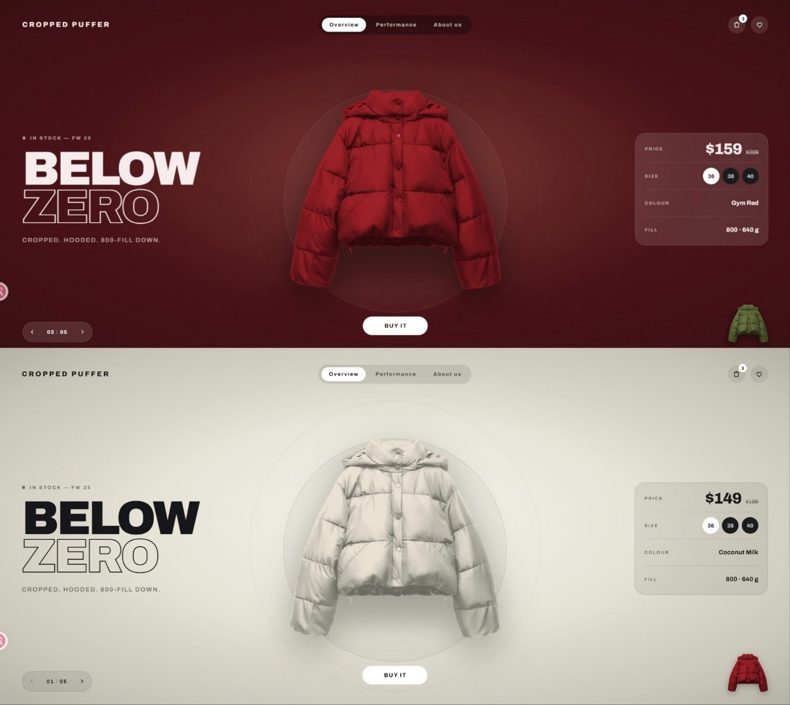

# Cropped Puffer

A single-page storefront for one jacket in five colourways. No routing, no
backend — the whole thing is one screen driven by React state.



The interesting part is not the shop. It is that every transition is measured
from the live layout at the moment it starts, so nothing in it breaks when the
window is a different size.

```
npm install
npm run dev
```

Then open the address Vite prints. `npm run build` produces a static `dist/`
that any host will serve as-is.

## Demo

_Recording of the colourway swap — to come._


---

## What is on screen

Five colourways, ordered light to dark, stepped through with the arrows in the
bottom-left corner. Stepping right dims the room: the background, the text, the
lighting and the price all follow the garment.

| | |
|---|---|
| **Header** | Product name, a pill nav whose white indicator slides between items, cart and wishlist. The cart opens a drawer down the right edge. |
| **Left** | Voice only — an eyebrow, a two-word display lockup with the second word drawn as an outline, one line of facts. |
| **Centre** | The jacket over two concentric hairline rings, with a `Buy it` button below. |
| **Right** | Hard facts: price, size, colour, fill. Values that change with the colourway animate in and out. |
| **Corners** | The arrow control bottom-left, the next colourway's thumbnail bottom-right. They mirror each other: what you press, and what it brings in. |

Below the first screen are two more full-height sections — a specification
plate and an about page. The page scrolls one section per gesture rather than
freely.

The specification screen carries no picture of the jacket, deliberately. It used
to: a photograph registered with crop marks and measured with dimension lines.
It was the weakest thing on the site — the first screen shows the garment
better, and a photograph says nothing at all about performance, which is what
that screen is for. In its place the headline claim is drawn as the range it
actually is: one measure against one scale, filled in the colourway's own
colour, so the screen still answers which jacket you are looking at.

## The swap

This is where most of the work is.

Both jackets ride **one diagonal**, from the corner thumbnail at the bottom
right to the top edge of the screen. Going forward, the outgoing jacket shrinks
away up that diagonal and out of frame while the next one grows out of the
thumbnail. Going back it runs exactly in reverse — the arriving jacket comes in
over the top edge and the outgoing one docks in the corner.

Three decisions hold it together:

**The path is measured, never hardcoded.** `getBoundingClientRect()` on the
stage, the thumbnail and the nav item at click time gives the offsets and the
scale. Both images are `object-fit: contain`, so the scale compares the
*fitted* rectangles rather than the boxes — otherwise the flying jacket lands
near the thumbnail's size but not exactly on it. On the corner it is the
thumbnail's `img` that is measured, not the button around it, which is a pixel
and a half taller than its box. That pixel and a half was visible.

**The screen's own edge ends the jacket.** `.screen` is `overflow: hidden`, so
nothing fades on the upper leg in either direction — a jacket is at full
strength for every frame it can be seen. There were fade windows here once, and
they were a second mechanism doing the clip's job: they had to agree with it
about *when* the diagonal crosses the edge, that moment is a function of the
aim, and re-aiming the diagonal left them describing a path the jacket no
longer took.

**The corner hand-over is a swap under cover, not a cross-fade.** Two copies of
one image at opacity `a` and `b` composite to `1-(1-a)(1-b)` — about 0.75 at
the midpoint — so cross-fading a jacket into the thumbnail underneath it washes
out and then snaps back to solid. Only one of them is ever in that corner. For
the same reason only one element casts a shadow at a time: stacking two darkens
the spot and then lightens it, which reads as a heartbeat.

The timing constants all live in [`src/animation.js`](src/animation.js), with
the reasoning next to each one.

## The scroll

One gesture, one section. CSS snapping alone will not do this — it releases to
the *nearest* snap point, so anything short of half a screen springs back where
it came from.

The handler instead accumulates wheel delta until it crosses a threshold, which
treats a mouse's single big notch and a trackpad's stream of one-pixel events
the same. The lock is released when the wheel goes **quiet**, not on a timer:
one swipe of a trackpad keeps sending events for a second or more as its
momentum decays, and a fixed timer expiring mid-stream reads the rest of the
same swipe as a second gesture. Since inertia only ever fades, an event
markedly bigger than the one before it is a finger pushing again rather than
the tail of the last swipe, which stops a long decay from swallowing the next
deliberate gesture.

Touch and keyboard go through the same path.

## The images

All five colourways are **recoloured from one photograph** by
`npm run jackets` ([`scripts/prepare-jackets.mjs`](scripts/prepare-jackets.mjs)),
reading `assets-source/jacket-source.png`.

Black cloth carries no hue to rotate, so a hue shift returns black. What it
does carry is shading — the quilting, the folds, the sheen — and that is all in
the luminance. So each variant treats luminance as a shading map, normalises it
against the garment's own range, and paints that shading onto a target colour,
keeping highlights white because a highlight is the colour of the light, not of
the cloth.

The script also rebuilds alpha for sources that arrive without it, in four
modes: `alpha`, `checker` (a transparency checkerboard baked into a JPEG),
`plain` (a real studio backdrop) and `noisy` (transparency flattened into
speckle).

> **Keep `assets-source/`.** The colourways cannot be regenerated without it.
> `src/assets/*.png` are generated but committed, so a fresh clone runs without
> having to build them first.

## The sound

The `Buy it` button's confirmation tone is synthesised in
[`src/sound.js`](src/sound.js) rather than loaded — the page has no backend, and
the shortest usable mp3 still costs a request, a decode and a format matrix to
get right in every browser.

It is built as a struck object rather than as a tone, which is the difference
between a chime and a beep: four partials per note decaying at different rates
with the high ones going first, one of them deliberately inharmonic, a few
milliseconds of high-passed noise on top so there is a strike and not just an
onset, and reverb, because nothing gives away a synthesised sound faster than
being perfectly dry.

## Layout of the source

```
src/
  App.jsx               state, the measured swap geometry, the scroll handler
  animation.js          every timing constant, with the reasoning
  themeStates.js        the five colourways — add an entry and everything picks it up
  sound.js              the Buy button's tone
  components/           one .jsx and one .module.css each
scripts/
  prepare-jackets.mjs   the recolouring pipeline
  shot.mjs              screenshots the dev server through installed Chrome
assets-source/          the one photograph everything is derived from
```

`npm run shot` drives a real browser over the running dev server so a change can
be looked at rather than only reasoned about. It uses the Chrome or Edge already
installed on the machine — `puppeteer-core` downloads no browser of its own — and
currently looks for them at Windows paths.

## Stack

React 18, Vite, CSS Modules, Framer Motion. No UI library, no CSS framework.
